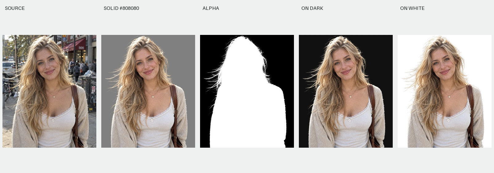
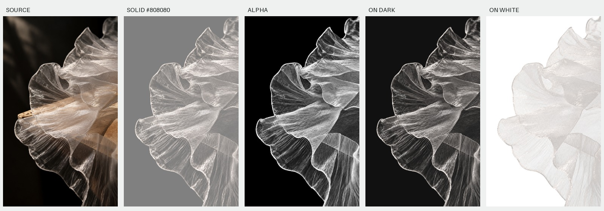
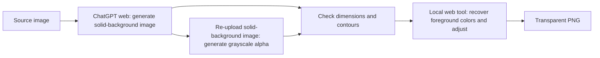

[English](README.md) | [简体中文](README.zh-CN.md)

# Paired Matte · Translucent Cutouts with Paired Alpha Masks

**Create translucent cutouts with generated image pairs and a local web tool—no professional image-editing software required.** Paired Matte combines image generation in ChatGPT on the web, grayscale masks, alignment checks, and foreground color recovery into a repeatable workflow that can be organized into batches. It is designed for fine details such as hair, sheer fabric, and flowing ribbons.

This is a workflow and a tool, not a new matting model. ChatGPT generates the intermediate assets; the web tool estimates foreground colors from an existing alpha mask and a known background color, then exports an RGBA PNG.

**Before using the web tool, prepare an aligned pair: a color image on a solid background and a grayscale alpha mask. The tool does not identify, select, or isolate objects directly from a complex-background source image, nor does it generate masks.** This project provides a process for preparing paired assets and a tool for subsequent transparent compositing—not an automatic segmentation tool that removes the background from any uploaded image in one click.

### Blonde portrait: fine hair and opaque areas



### Translucent fabric: fine fibers, folds, and transparency



## Features

- **No professional editing software required**: Prepare the paired images in ChatGPT on the web, then composite and export them in the browser, without manually painting masks in professional software. Format checks can be performed with the included scripts or an agent that supports the Skill.
- **Designed for detailed results**: A shared geometry reference, contour overlays, and checks on dark and white backgrounds help produce aligned edges while preserving translucent detail. The examples demonstrate achievable results; they do not guarantee automatically generated, pixel-perfect alpha for every input.
- **Batch-oriented workflow**: Standardize prompts, naming, settings, and acceptance checks; process files sequentially, track progress, and resume after interruptions. Batch processing does not mean opening multiple generation sessions at once, and the web tool does not offer one-click folder processing.
- **Local compositing**: The web tool runs offline and exports transparent PNGs. Only the preceding ChatGPT image-generation stage requires uploading images.

## Why this project exists

In cutout tasks that require high precision—such as hair or animal fur against complex backgrounds, or translucent elements such as lighting effects, shadows, and sheer fabric—traditional image editors such as Photoshop and dedicated background-removal tools often struggle to deliver satisfactory results without substantial time and effort. Each image needs individual refinement, making batch processing impractical. Even now that GPT Image 2.5 can accurately generate images with transparency, the extracted images still fall short of precise edges or consistency with the original.

Our approach is to first generate a color image on a known solid background, then use that image as the sole geometry reference to generate a grayscale alpha mask. Finally, we remove background color contamination in the browser and inspect the result against different backgrounds.



**Generate the solid-background image first, then generate the mask from it. Do not generate the two outputs independently from the original.** Matching dimensions do not guarantee matching contours; “pixel alignment” in a prompt is a goal, not a guarantee of the model's capabilities.

## Try the examples in five minutes

Start with the [step-by-step walkthrough](walkthrough.html). Using the fabric example, it covers defining the subject, prompting for the two images, checking alignment, operating the actual web tool, and exporting a PNG. Download the prepared image pair to follow along without using additional image-generation quota.

1. Download the entire repository and open [cutout-tool.html](cutout-tool.html) by double-clicking it. No installation or local server is required.
2. Load the [fabric color image](examples/pearl-gauze/solid.png) and [fabric mask](examples/pearl-gauze/alpha.png). Alternatively, use the [blonde portrait color image](examples/blonde-portrait/solid.png) and [portrait mask](examples/blonde-portrait/alpha.png). Do not mix files from different pairs.
3. Select the red contour overlay (“红线轮廓”) and enable actual size (“原尺寸”). Inspect fabric edges, tips, holes, or fine hair. When preparing new assets, perform this check against the raw solid-background image before it has been clipped using the mask.
4. For both examples, select the general preset that preserves the mask (“通用 · 保留原遮罩”) and set the background to `#808080`. Inspect dark, white, and checkerboard previews. Do not apply white-fabric neutralization to blonde hair.
5. Click “下载 PNG” (Download PNG). The download is always the transparent result, even when the preview is showing the mask or red contour overlay.

The web tool processes images locally, with no external scripts, fonts, analytics, or network requests. **The ChatGPT generation stage, however, uploads the source image to ChatGPT**, using your own account and available quota.

## Prepare your own assets

### Recommended background: neutral mid-gray #808080

The default is **#808080 (RGB 128,128,128)**: a uniform background with no gradients, texture, or shadows. Its three channels are equal, avoiding the hue bias introduced by a colored background. Compared with pure white or pure black, it offers a compromise for inspecting both light fabric threads and dark details. More importantly, a known, consistent background reduces the unknowns in foreground color recovery.

This is not green-screen chroma keying, nor does it remove pixels simply because they are gray: transparency comes from the paired mask, so gray subjects can be preserved. #808080 is not mathematically optimal for every material and cannot eliminate generation errors or error amplification at low alpha. Other solid colors can be used, but prompts, records, validation scripts, and web-tool settings must all agree. See [Background color selection](docs/background-color.md).

See the [complete workflow](docs/workflow.md). You can operate ChatGPT on the web manually or give the included Skill to an agent with browser/computer-control capabilities.

- [Skill entry point](skills/gpt-image-2-subject-assets/SKILL.md)
- [Copyable Chinese prompts](skills/gpt-image-2-subject-assets/references/prompts.zh-CN.md)
- [Browser workflow and resuming progress](skills/gpt-image-2-subject-assets/references/browser-workflow.md)
- [Validation commands](skills/gpt-image-2-subject-assets/references/validation.md)

The Skill retains its historical name, `gpt-image-2-subject-assets`, for migration compatibility. **It does not lock the workflow to GPT Image 2 or guarantee which model version the website actually uses.** The web route is the default; use built-in image generation only when explicitly requested. No OpenAI API key is required.

To install, copy the entire `skills/gpt-image-2-subject-assets/` folder into the skills directory supported by your environment. This project does not automatically overwrite an existing Skill with the same name; compare the files first if one is already installed. You can also ask an agent:

> Read skills/gpt-image-2-subject-assets/SKILL.md in this repository and process this image through the ChatGPT web workflow. Use background #808080 and save the results to my specified directory. Process images sequentially, check alignment, and then export transparent PNGs.

The Skill consists of instructions and supporting files, not an automatic ChatGPT login program. Browser control is provided by the agent using it. Without that capability, you can still follow the documentation manually. [Official Skill documentation](https://learn.chatgpt.com/docs/build-skills)

## Examples

| Example | Focus | Inputs and results |
|---|---|---|
| Veiled swordswoman | Large areas of sheer fabric, two swords, and fine hair | [Details](examples/veil-warrior/README.md) |
| Silver-haired swordsman | Blue-and-white ribbons and a long sword; mask displacement occurred in earlier iterations | [Details](examples/silver-swordsman/README.md) |
| Duo with magical artifacts | Characters, artifacts, chains, and blue smoke; limitations of ordinary alpha | [Details](examples/magic-duo/README.md) |
| Realistic blonde portrait | Hair, knitted clothing, and opaque subject areas; tested through the web workflow | [Details](examples/blonde-portrait/README.md) |
| Pearl-white translucent fabric | Continuous grayscale, fine fibers, and removal of wood visible through fabric; tested through the web workflow | [Details](examples/pearl-gauze/README.md) |

**None of the five examples is a public benchmark. They have no ground-truth alpha annotations and do not establish the accuracy of the estimated transparency.** Each includes the source, paired images, transparent PNG, dark/white previews, settings, and provenance. Open the [example gallery](review.html) for five-panel comparisons, and see the [asset notes](examples/ASSETS.md).

## Principles and limitations

The standard alpha compositing model is `I = αF + (1−α)B`. With a known background `B` and alpha, `F = [I−(1−α)B]/α`. The web tool builds on this relationship with bounded blending and optional heuristic adjustments. See the [algorithm notes](docs/algorithm.md).

### Input requirements and scope

- **Prepare both inputs first**: On your own or with an agent that supports this workflow, prepare a solid-background color image and a grayscale mask with matching position, dimensions, and cropping. The repository examples are ready to use; the web tool does not automatically prepare these inputs for other source images.
- **No object segmentation in complex scenes**: The web tool has no object recognition, click-to-select, or semantic segmentation features. Removing complex backgrounds, selecting subjects, and reconstructing occluded areas happen in the earlier generation or asset-preparation stage—not during alpha compositing in the browser.
- **Hidden original information cannot simply be recovered**: Removing the wooden support while retaining the fabric in the example involves model estimation and reconstruction. It is not a lossless extraction of fabric colors or structures that were invisible in the original.
- **Output quality depends on the pair**: Incorrect masks, misaligned contours, nonuniform backgrounds, and remnants of the old background inside translucent areas carry through to the final PNG. Browser adjustments are no substitute for valid inputs and cannot automatically repair geometry.
- **Preparation has time and service costs**: ChatGPT on the web requires an account, a network connection, and available quota; generation may require retries. The local web tool itself runs offline. Not needing professional software does not mean no preparation, no review, or zero cost throughout.
- **Batching organizes the workflow; it is not one-click automation**: Every image still needs paired generation and quality checks. The current web tool handles one pair at a time and provides no folder processing, automatic alignment, or automatic quality assessment.

### Limitations of transparency and color recovery

- Generated images may shift, redraw, or omit content. Regenerate the mask when local misalignment occurs.
- Low alpha amplifies errors in the background color and mask. Background normalization and endpoint clipping can also remove faint halos.
- White-fabric settings alter color and alpha; they are not a general-purpose physical reconstruction.
- Glass refraction, emission, and additive-blending effects may not be fully reproducible on arbitrary backgrounds using a single ordinary RGBA image.
- A single composite image generally does not uniquely determine both foreground color and alpha. This project does not promise lossless cutouts for arbitrary inputs.

## Code and development

| Path | Contents |
|---|---|
| `cutout-tool.html` | Standalone tool that opens directly in a browser (built output) |
| `src/` | HTML template, CSS, and JavaScript source |
| `skills/gpt-image-2-subject-assets/` | Copyable Skill, prompts, validation scripts, and tool |
| `examples/` | Example assets, settings, transparent outputs, and comparison images |
| `tests/` | Browser regression tests for file import and download |

The web tool has no runtime dependencies. Development builds require Node.js 20+; helper checks require Python 3.10+ and Pillow.

```bash
npm ci
npm run build
npx playwright install chromium
npm test
npm run check
python3 -m pip install -r requirements.txt
python3 scripts/verify_examples.py
```

`npm run build` updates both the root HTML file and the copy bundled with the Skill. Do not edit these generated files directly. See [Contributing](CONTRIBUTING.md) and the [verification record](docs/verification.md).

## License and assets

The code, Skill, and documentation are licensed under the [GNU GPL v3 or later (GPL-3.0-or-later)](LICENSE). See [COPYRIGHT.md](COPYRIGHT.md) for scope and copyright notices. Example images have a separate [usage policy](examples/ASSETS.md) and are not automatically covered by the code license. The image-generation service and accounts are not part of this repository. This is not an official OpenAI project.

All five sets of example assets were created by the author and authorized for demonstration in this project. Before using your own assets, ensure you have the necessary rights to process and upload them. Use the [quality checklist](REVIEW.md) to review results.
