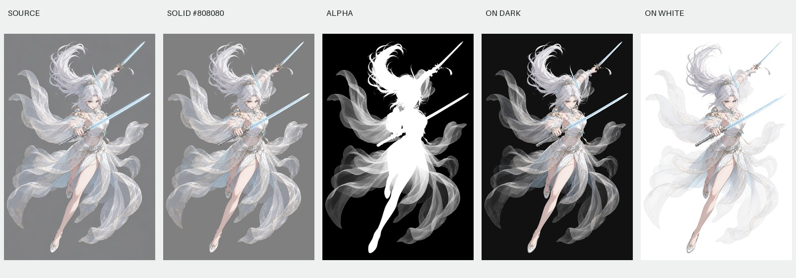
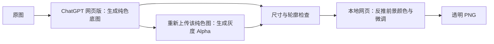

# Paired Matte · 配对遮罩半透明抠图

**中文版 v0.1 草稿，尚未发布。** 将 ChatGPT 网页版生图、配对灰度遮罩、对齐检查和本地网页前景颜色恢复串成一套可复用流程。适合探索白纱、发丝、飘带等半透明素材的提取。

这是一套工作流与工具，不是新的抠图模型。ChatGPT 负责生成中间素材；网页使用已有 Alpha 和已知底色估计前景，导出 RGBA PNG。



## 为什么做这个项目

只有黑白轮廓，薄纱会变成不透明的布；直接把灰度遮罩作为 Alpha，颜色中又可能留下原来的灰底。我们的实践是先生成一张已知纯色底的彩色图，再以这张图为唯一几何参考生成灰度 Alpha，最后在浏览器中去除背景混色，并检查不同底色上的结果。



**先做纯色图，再从它生成遮罩。不要从原图独立生成两张结果。** 同尺寸也不保证同轮廓；提示词中的“像素对齐”是目标，不是模型的能力保证。

## 五分钟体验已有素材

初次使用可先打开[完整分步演示](walkthrough.html)：以纱物为主例，从原图范围、两张图片的生成提示词、对齐验收到真实网页操作与 PNG 导出。可下载现成配对图直接跟做，不必重新消耗生图额度。

1. 下载整个仓库，双击根目录的 [cutout-tool.html](cutout-tool.html)。无需安装、无需启动服务。
2. 上传 [示例纯色图](examples/veil-warrior/solid.png) 和 [示例遮罩](examples/veil-warrior/alpha.png)。默认底色为 `#808080`。
3. 切换“红线轮廓”，勾选“原尺寸”，检查剑尖、发丝、腿部和纱带边缘。
4. 此示例可选择“白纱 · 历史经验参数”。切换黑、白、棋盘格底色观察效果。
5. 点击“下载 PNG”。即使正在查看遮罩或红线，下载的仍是透明结果。

网页处理发生在本地，无外部脚本、字体、统计或网络请求。**ChatGPT 生图阶段则会将原图上传到 ChatGPT**，使用的是用户自己的账号和可用额度。

## 生成自己的素材

详见 [完整流程](docs/workflow.md)。可手工操作 ChatGPT 网页版，也可把本仓库的 Skill 交给具有浏览器/电脑操作能力的代理。

- [Skill 入口](skills/gpt-image-2-subject-assets/SKILL.md)
- [可复制的中文提示词](skills/gpt-image-2-subject-assets/references/prompts.zh-CN.md)
- [网页版操作与恢复进度](skills/gpt-image-2-subject-assets/references/browser-workflow.md)
- [检查命令](skills/gpt-image-2-subject-assets/references/validation.md)

Skill 保留历史名称 `gpt-image-2-subject-assets` 以便迁移，**不表示锁定 GPT Image 2，也不保证网页实际使用的模型版本**。网页版为本公开草稿的默认路径；仅在用户明确选择时使用内置生图路径。不需要 OpenAI API Key。

安装时将整个 `skills/gpt-image-2-subject-assets/` 文件夹放入运行环境支持的技能目录。本项目不自动覆盖已有同名技能；已有安装请先比较差异。也可以直接对代理说：

> 请读取本仓库 skills/gpt-image-2-subject-assets/SKILL.md，按 ChatGPT 网页版流程处理这张图。底色 #808080，结果保存到我指定的目录。逐张串行处理，检查对齐后导出透明 PNG。

Skill 是操作说明及辅助文件，不是一个自动登录 ChatGPT 的程序；浏览器控制能力由使用它的代理提供。没有该能力时仍可按文档手工操作。[官方 Skill 文档](https://learn.chatgpt.com/docs/build-skills)

## 实际演示

| 案例 | 关注点 | 输入与结果 |
|---|---|---|
| 白纱女剑士 | 大面积薄纱、双剑、发梢 | [说明](examples/veil-warrior/README.md) |
| 白发男剑士 | 蓝白飘带、长剑；历史上出现过遮罩位移 | [说明](examples/silver-swordsman/README.md) |
| 双人法器 | 人物、法器、链条、蓝色烟雾；普通 Alpha 的局限 | [说明](examples/magic-duo/README.md) |
| 写实金发人物（新增） | 发丝、针织衣料、不透明主体；网页版流程实测 | [说明](examples/blonde-portrait/README.md) |
| 珍珠白半透明纱物（新增） | 连续灰度、细丝、去除透过纱可见的木台；网页版流程实测 | [说明](examples/pearl-gauze/README.md) |

前三组为历史 AI 素材及配对结果，部分中间图使用 Codex 内置生图完成，本次仅用整理后的网页重新导出透明结果；它们不构成网页版全流程重新实测。新增两组于 2026-09-17 在 Safari 中完成 ChatGPT 网页版生成灰底、重新上传灰底生成遮罩、对齐检查和本地网页导出，保留了已经交付的结果像素。

**五组均不是公开 benchmark，没有真实 Alpha 标注，也不证明“真实透明度准确”。** 每组包含原图、配对图、透明 PNG、黑白底预览、处理参数和来源说明。可打开[演示总览](review.html)查看五联对比，详见[素材说明](examples/ASSETS.md)。

## 原理与限制

普通 Alpha 合成模型：`I = αF + (1−α)B`。当底色 `B` 与 Alpha 已知时，`F = [I−(1−α)B]/α`。本网页在此基础上做受限混合及可选经验修正。[算法说明](docs/algorithm.md)

- 生成图可能移动、重绘或遗漏内容；遇到局部错位应重新生成遮罩。
- 小 Alpha 会放大底色和遮罩误差；纯色化与端点截断也可能损失弱光晕。
- 白纱参数会改变色彩和 Alpha，不是通用物理还原。
- 玻璃折射、发光和加法混合效果未必能用一张普通 RGBA 在任意背景上完整复现。
- 从一张合成图通常不能唯一确定前景颜色与 Alpha；本项目不承诺任意图片无损抠图。

## 代码与开发

| 路径 | 内容 |
|---|---|
| `cutout-tool.html` | 可直接打开的单文件工具（构建产物） |
| `src/` | HTML 模板、CSS、JavaScript 源码 |
| `skills/gpt-image-2-subject-assets/` | 可独立复制的 Skill、提示词、检查脚本、工具 |
| `examples/` | 演示素材、参数、透明结果、对比图 |
| `tests/` | 真实浏览器文件导入与下载回归测试 |

网页无需依赖。开发构建需要 Node.js 20+；辅助检查需要 Python 3.10+ 和 Pillow。

```bash
npm ci
npm run build
npx playwright install chromium
npm test
npm run check
python3 -m pip install -r requirements.txt
python3 scripts/verify_examples.py
```

`npm run build` 同时更新根目录与 Skill 自带 HTML。不要直接修改这两个构建产物。参见 [贡献说明](CONTRIBUTING.md) 和 [测试记录](docs/verification.md)。

## 开源范围与发布状态

代码、Skill 和文档采用 [GNU GPL v3 或更新版本（GPL-3.0-or-later）](LICENSE)，范围与版权声明见 [COPYRIGHT.md](COPYRIGHT.md)。演示图像另见 [素材使用范围](examples/ASSETS.md)，不自动按代码许可证授权。网页生图服务及账号不包含在开源仓库中；项目不是 OpenAI 官方产品。

本地审阅清单在 [REVIEW.md](REVIEW.md)。本版用于 GitHub 私有仓库 `SontaBeat/paired-matte` 备份与审阅；不自动公开仓库、部署 GitHub Pages 或创建 Release。作者已确认五组演示素材为本人制作并授权用于项目演示。

## 相关工作

[PyMatting](https://github.com/pymatting/pymatting)、[FBA Matting](https://github.com/MarcoForte/FBA_Matting) 提供 Alpha/前景估计方法；[BiRefNet](https://github.com/ZhengPeng7/BiRefNet) 和 [ViTMatte](https://github.com/hustvl/ViTMatte) 可作为未来自动 matting 的比较对象。本仓库没有包含或调用这些模型，也没有声称效果优于它们。
