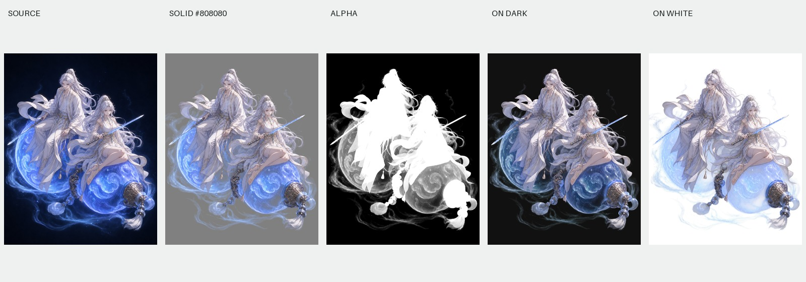

# 双人法器与烟雾

尺寸：1122 × 1402。主体包括两个人物、剑、两颗法器、链条和周围的烟雾，不是只提取人体。

- [原图](source.png)、[灰底图](solid.png)、[单通道遮罩](alpha.png)、[透明结果](cutout.png)。
- [深色底预览](preview-black.png)、[白底预览](preview-white.png)。
- [处理参数](settings.json)、[来源与完整性](manifest.json)。

采用“通用 · 保留原遮罩”：黑场 0、白场 1、反推 0.90、灰边清理 0、白纱中和 0。导出保留遮罩灰度，不对白纱作特殊中和。

此例也用来展示限制：烟雾在白底上变淡，蓝色光效在深色底上的亮度与原图并不完全相同。普通 RGBA 不能普遍复现发光、加法混合与折射；需要强烈发光效果时，通常还需要独立发光层及使用端的混合方式。这不是已提供的额外导出功能。

历史配对素材来自内置生图路线。使用离线网页重新导出透明 PNG，未重跑网页版生成。图片许可见 [素材说明](../ASSETS.md)。
