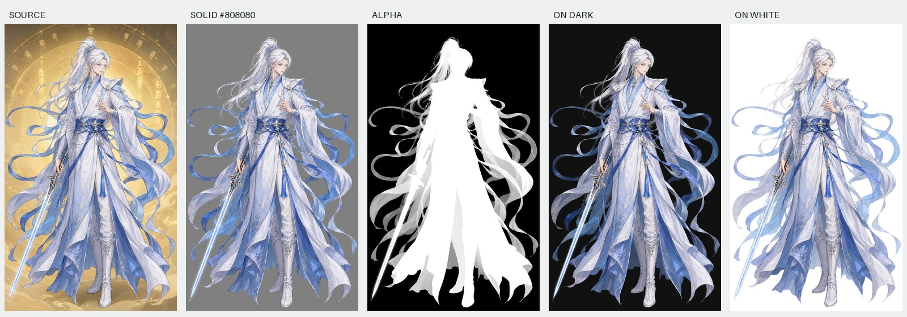

# 白发男剑士

尺寸：971 × 1619。关注蓝白飘带、长剑、衣摆和发丝。

此人物在历史处理中曾出现遮罩位移，因此保留为**检查对齐的重要案例**，而不是宣称所有边缘都已达到逐像素精确的标准答案。同尺寸不是对齐证明；请在网页中使用“红线轮廓 + 原尺寸”检查。

- [原图](source.png)、[灰底图](solid.png)、[单通道遮罩](alpha.png)、[透明结果](cutout.png)。
- [深色底预览](preview-black.png)、[白底预览](preview-white.png)。
- [处理参数](settings.json)、[来源与完整性](manifest.json)。

使用历史白纱预设，参数与白纱女剑士相同。该预设会影响蓝色飘带与高亮边缘；若颜色过淡，应改用通用预设并减小灰边清理，而不是把每个材质都按白纱处理。

历史路线是网页版纯色图与内置生图遮罩的混合流程；本次重跑的是网页本地恢复及导出。对比中可以看到源图的金色背景不再作为整块背景保留，但这不证明遮罩没有细节误差。图片许可见 [素材说明](../ASSETS.md)。
